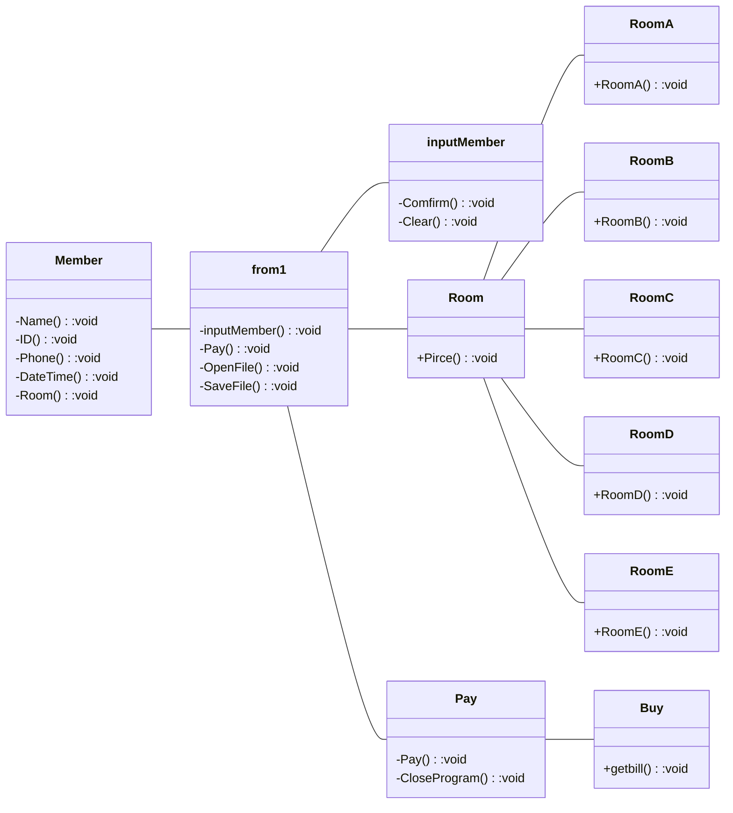

1.ความเป็นมาของโปรแกรม
```
ปัญหาคือ มีผู้ที่มาจองห้องพักจำนวนมาก และทำให้พนักงานม่ไม่พอเพียงต่อลูกค้า จึงทำขึ้นเพื่อความสะดวกและรวดเร็วต่อการจองห้องพัก
```
2.วัตถุประสงค์ของโปรแกรม
``` 
1) เพื่อให้ผู้ที่มาพักเจอปัญหาห้องพักเต็ม
2) สามารถจองได้อย่างสะดวกและรวดเร็ว
3) มีการคำนวณราคาที่ถูกต้อง ไม่กลัวทอนเงินขาดหรือเกิน
4) สามารถเก็บเป็นข้อมูลได้ จะได้ไม่สับสนเวลาคนมาจองจำนวนมาก
```
3.โครงสร้างของโปรแกรม (Class diagram) ของโปรแกรม ใช้ Mermaid ในการเขียน ตัวอย่าง การเขียน Classdiagram ใน Markdown  
Class Diagram

4.ชื่อของผู้พัฒนาโปรแกรม
```
นาย วรโชติ ทองเลิศ 653450299-0
```
